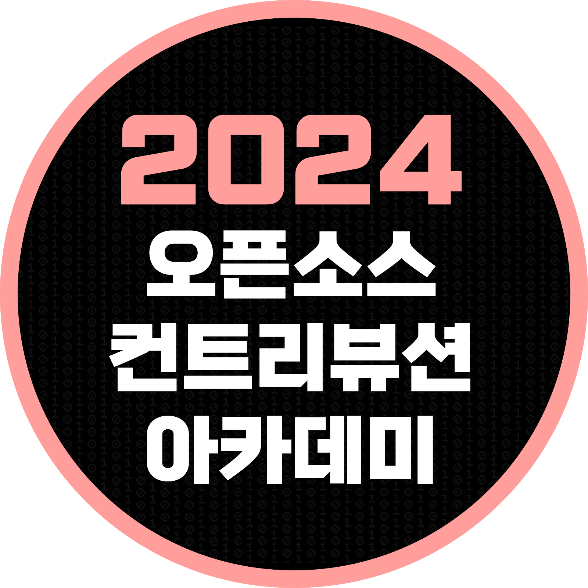
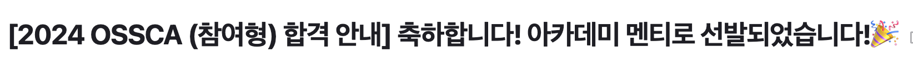

  

지난 6월 가짜연구소 7th 슈도콘에 참여한 이후, 오픈소스 컨트리뷰션이란 것을 알게 되었던 OSSCA
(오픈 소스 아카데미).

Hugging Face OSS 프로젝트에 가장 관심이 갔고,
1, 2차 모두 Hugging Face OSS 프로젝트로 지원해서 그런지 선발되었다. 🙇🏻‍♂️ (THX) 🙇🏻‍♂️

## **발대식 전까지 준비사항:**  
디스코드 입장 및 [Open UP YouTube](www.youtube.com) 기본교육 수강하기

**7월 주요 일정:** `안내사항은 디스코드를 확인`  
- `7.13.` 2024 OSSCA 발대식  
- `7.13. ~ 8.9.` [Challenges: 4주]: 
  - 프로젝트 컨트리뷰션을 위한 환경 세팅+이슈 선정 등의 온보딩 기간
- `7월 중` 중간보고 작성

새로 알게 된 것은, Challenges 기간과 Master 기간이 나뉘어 있다는 것이다. 7월은 컨트리뷰션 할 프로젝트에 대해서 이해하고, 이슈 선정하는 시간인 것 같다.

## **프로젝트 개요:**  
OSSCA에는 다양한 [프로젝트 목록](https://www.contribution.ac/)이 있다.  
그중 참여하게 된 오픈소스 프로젝트는 [Hugging Face](https://github.com/huggingface) 한글화이다.

> 활용 기술: ` Python, Jupyter Notebook, Gradio, Markdown, Git`
>
Gradio는 처음 활용해보게 될 패키지인데, 대시보드 툴인 것 같다.

> 주요 내용:
>> 1. 허깅페이스 기술문서 한글화
>> 2. 허깅페이스 용어집
>> 3. 허깅페이스 이해하기
>> 4. 허깅페이스 생태계에 기여하기

> 일정:
>> - Challenges 기간: [Transformers 문서](https://huggingface.co/docs/transformers/index)를 통해 한글화 작업을 연습
>> - Master 기간: 필수 활동과 1개 이상의 선택 활동
>>   - 필수 활동: [Open-Source AI Cookbook](https://huggingface.co/learn/cookbook/index) 한글화 및 실습 + 스터디
>>   - 선택 활동: 
>>     - Hugging Face 프로젝트 코드 기여 / 
>>     - Open-Source AI Cookbook 콘텐츠 제작 / 
>>     - Hugging Face Spaces 내 ML Application 공유

> 컨트리뷰션 코드 가이드:
>> - (협업 방식) Github 및 PR / Branch 관리 방법 
>> - (기술 문서 번역) doc-builder, markdown, 인공지능 용어 한글화, 가독하기 좋은 기술문서 작성법
>> - (HuggingFace 생태계) 
>>   - Hugging Face 생태계의 기본 구조와 트랜스포머 모델 아키텍처 / 
>>   - 라이브러리 (Transformers, Datasets, Tokenizers, Accelerate) /
>>   자연어처리(NLP) 프로세스
>> - (AI 애플리케이션 구축 Use Case 실습) 
>>   - Open-Source AI Cookbook 번역 및 실습
>> - (프로젝트) Hugging Face 라이브러리를 사용한 사이드 프로젝트 개발
>>   - 멘토-멘티, Hugging Face 글로벌 커뮤니티 피드백을 기반으로 프로젝트를 개선

**기여하고 싶은 것:**  
이 중에서 어떤 것을 하게 될지 모르겠지만, 모두 흥미있어 보인다. 난이도도 있고, 특히 처음 하게 될 Transformer 모델은 잘 모르는 분야이지만 해보면서 기술 문서에 대한 번역과 관리는 어떻게 이루어지는지 경험해볼 수 있다.

**TODO:**
- Transformer 관련 자료 조사
- OpenUP youtube 교육 수강
