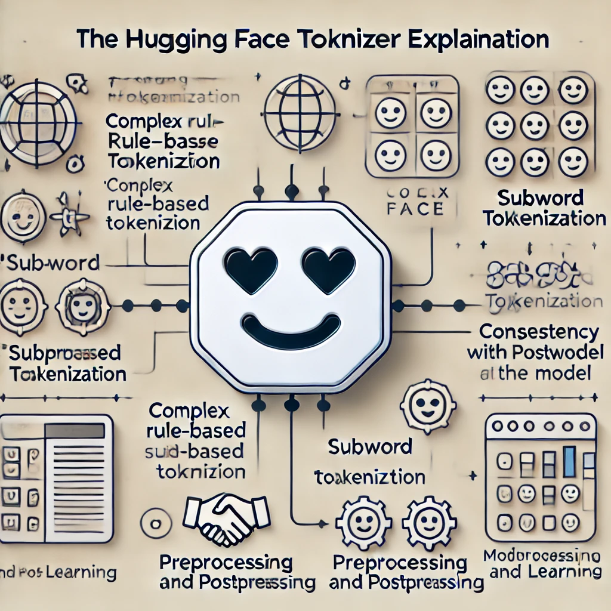

_** 본 문서는 GPT를 활용하여 제작되었습니다._

## 지난 주에는
DistilBertModel으로 구성된 sentiment-analysis와 question-answering 파이프라인을 가지고 실습을 진행했다. 

## 오늘은

Hugging Face의 감성 분석 데이터세트를 활용한다. 텍스트 데이터를 기계가 이해할 수 있는 형태로 변환하고, 훈련 가능한 형태의 데이터세트를 만듭니다. 

## Tokenizer
Hugging Face의 DistilBertTokenizerFast 클래스를 활용하여 [distilbert-base-uncased](https://huggingface.co/distilbert/distilbert-base-uncased) 모델을 불러와서 사용할 수 있다. 

### **1. 모델 불러오기**  
```tokenizer = DistilBertTokenizerFast.from_pretrained("distilbert-base-uncased")```
이를 실행하면, 프로그래스 바를 볼 수 있는데, 그 부분을 설명하자면 다음과 같다.


gpt-🤖:
이 메시지는 `DistilBertTokenizerFast.from_pretrained("distilbert-base-uncased")` 명령어를 실행할 때 Hugging Face 라이브러리가 필요한 파일을 다운로드하는 과정을 나타냅니다. 각 줄은 다운로드한 파일의 이름, 파일 크기, 다운로드 진행률 및 속도를 보여줍니다.

- **tokenizer_config.json**: 토크나이저의 설정 정보를 포함하는 JSON 파일입니다. 이 파일은 토크나이저의 동작 방식을 설정하는 데 사용됩니다.
  
- **vocab.txt**: 토크나이저의 어휘집(vocabulary)을 포함하는 파일입니다. 이 파일에는 모델이 인식할 수 있는 단어들이 나열되어 있습니다. 여기서는 약 232KB의 데이터를 다운로드합니다.

- **tokenizer.json**: 토크나이저의 어휘와 토큰화 규칙 등을 포함한 파일입니다. 이는 토크나이저의 전반적인 작동 방식을 정의합니다. 여기서는 약 466KB의 데이터를 다운로드합니다.

- **config.json**: 모델의 설정 정보를 포함하는 JSON 파일입니다. 여기에는 모델 아키텍처, 하이퍼파라미터 등이 포함됩니다.

이 메시지들은 모두 Hugging Face의 사전 훈련된 모델과 토크나이저를 로드하기 위해 필요한 파일들이 정상적으로 다운로드되었음을 나타냅니다. 이는 이후에 `DistilBertTokenizerFast` 객체가 생성되어 사용할 준비가 완료되었다는 것을 의미합니다.

### **2. 토크나이징**
문장을 의미 있는 가장 작은 단위로 나누는 과정이다. 왜 토크나이저는 Rule based 혹은 regex로 텍스트를 처리하는 도구가 아니라 학습된 모델인지 궁금해졌다.

gpt-🤖: Hugging Face의 토크나이저는 자연어 처리(NLP)에서 텍스트를 모델이 이해할 수 있는 형태로 변환하기 위한 도구입니다. 토크나이저가 단순한 알고리즘이 아닌 "모델"로 여겨지는 이유는 다음과 같습니다.

### 1) **복잡한 규칙 기반 토큰화**
   - **단순한 토큰화 알고리즘**은 공백을 기준으로 단어를 분리하거나, 구두점을 제거하는 등의 간단한 작업을 수행합니다. 하지만 자연어는 매우 복잡하고 예외적인 경우가 많기 때문에 이런 간단한 규칙만으로는 충분하지 않습니다.
   - **Hugging Face 토크나이저**는 BERT, GPT 등의 모델에 맞춰 훈련된 복잡한 규칙과 어휘 집합을 사용하여 텍스트를 토큰화합니다. 예를 들어, BERT 계열의 토크나이저는 단어를 서브워드(subword) 단위로 나누는 WordPiece, SentencePiece, Byte-Pair Encoding(BPE) 등의 방법을 사용합니다.

### 2) **서브워드 토큰화**
   - Hugging Face의 모델들은 주로 **서브워드(subword)** 단위로 텍스트를 토큰화합니다. 예를 들어, "playing"이라는 단어는 "play"와 "-ing"으로 나뉠 수 있습니다. 이를 통해 모델은 희귀하거나 복잡한 단어를 더 작은 단위로 쪼개서 처리할 수 있습니다.
   - 서브워드 토큰화는 언어적 특성과 특정 어휘 빈도에 기반해 최적화되며, 단순한 규칙만으로 처리하기 어렵습니다.

### 3) **모델과의 일관성 유지**
   - **토크나이저는 모델과 강하게 결합**되어 있습니다. 예를 들어, BERT 모델이 훈련된 동안 사용된 동일한 토크나이저를 사용하지 않으면, 입력 텍스트의 토큰화 방식이 달라져 모델의 성능이 저하될 수 있습니다.
   - 또한, 토크나이저는 모델의 어휘(vocabulary)와 일치해야 합니다. Hugging Face의 토크나이저는 특정 모델과 일관된 어휘 집합을 갖고 있어, 이들 간의 일관성을 유지합니다.

### 4) **전처리와 후처리 기능**
   - Hugging Face 토크나이저는 텍스트를 토큰화하는 것 외에도 패딩(padding), 마스킹(masking), 특수 토큰 삽입([CLS], [SEP] 등)과 같은 추가 작업도 수행합니다. 이러한 작업들은 모델의 입력 형식에 맞게 데이터를 준비하는 과정에서 매우 중요한 역할을 합니다.

### 5) **모델의 이해와 학습**
   - 토크나이저는 단순히 데이터를 처리하는 것이 아니라, 해당 데이터를 이해하고 최적화된 방식으로 처리하기 위해 모델의 특성을 반영하여 설계됩니다. 이는 특정 NLP 모델이 텍스트 데이터를 학습하고 예측하는 데 필수적인 역할을 합니다.
   - 따라서, Hugging Face의 토크나이저는 단순한 규칙 기반 알고리즘보다는 모델의 중요한 구성 요소로서 동작하며, 모델의 성능과 직접적으로 연결됩니다.

### => 결론
Hugging Face 토크나이저는 자연어의 복잡성을 효과적으로 다루기 위해 설계된, 모델의 중요한 구성 요소입니다. 이 토크나이저는 텍스트를 모델이 이해할 수 있는 형태로 변환하고, 그 과정에서 단순한 규칙이 아닌 모델과 일관된 방식을 유지하여 성능을 최적화합니다. 그렇기 때문에 단순한 알고리즘이 아닌 "모델"로서 간주되며, 각 모델에 맞춰진 특수한 토크나이저가 존재하게 됩니다.



### **3. 인코딩**
인코딩을 거치면 토큰을 숫자로 변환하여 기계가 이해하기 편리한 형태가 된다. 토크나이저가 인코딩까지 해준다.

### 느낀점

- Hugging Face에서는 모델 구현체를 사용하기 쉽게 파이썬 클래스 형태로 제공하는 점이 편리했다.
